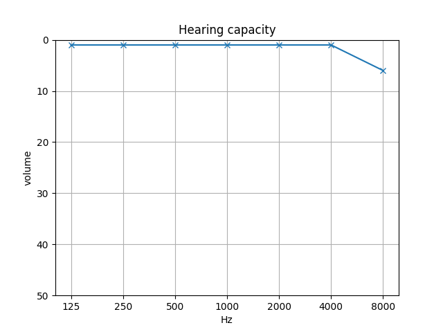
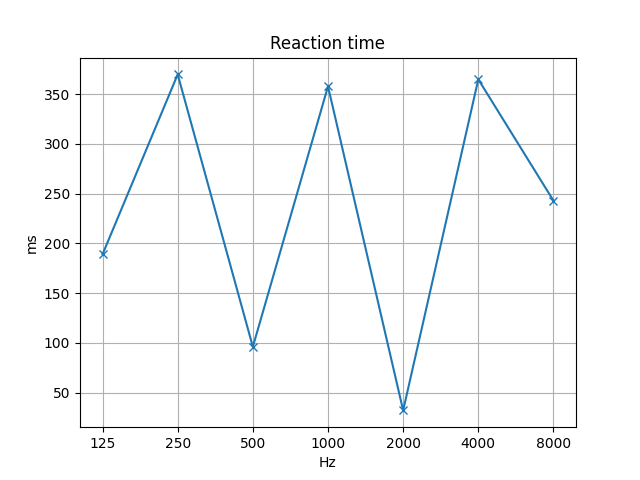

# Hearing test

Simple hearing test.
Hearing thresholds are determined on a standard set of frequencies from 125 Hz to 8 kHz.

**Disclaimer**

**This is NOT a proper medical examination.**
If you think you may have a hearing problem, consult a doctor.

## Running

```sh
docker build -t hearing-test .
```

```sh
docker run --rm -it -v `pwd`:/workspace --device /dev/snd hearing-test python3 start.py
```

You'll hear a pulsing sound at 7 different frequencies (125, 250, 500, 1000, 2000, 4000, 8000Hz) in a random order, repeated 2 times.

If you want to make test more accurate, increase number of repetitions using `repeat` parameter:

```sh
docker run --rm -it -v `pwd`:/workspace --device /dev/snd hearing-test python3 start.py --repeat 4
```

## Results

Script will store the data in CSV file and will automatically generate report about your hearing capacity and reaction time:

**Good**

<table>
<tr>
<td></td>
<td></td>
</tr>
</table>

**Bad**

<table>
<tr>
<td></td>
<td></td>
</tr>
</table>

## Troubleshooting

Try to restart sound controller on your host machine

```sh
sudo alsa force-reload
```
